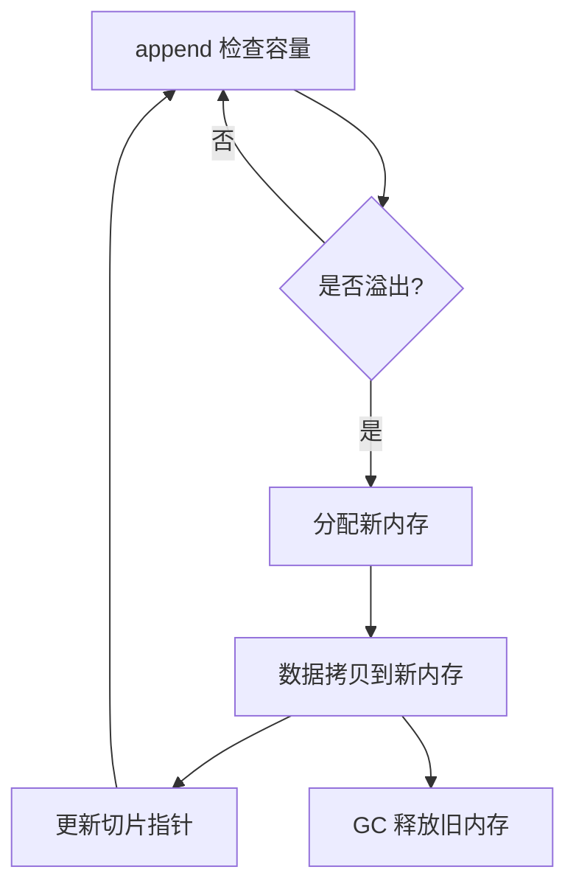

# Go 切片 make 预设容量的性能剖析与业务实践

本节剖析 `make` 预设容量的优势，并通过 benchmark 验证其性能收益。

---

## 一、常见写法对比（伪代码）

假设我们需要将一个列表做条件过滤和转换，常见有两种写法：

```diff
- // 默认容量写法
- result := make([]T, 0)
+ // 预设容量写法
+ result := make([]T, 0, len(src))
  for item in src {
      if 满足条件(item) {
          result = append(result, 转换(item))
      }
  }
  return result
```

- 预设容量：`make([]T, 0, N)`，N 为已知最大长度。
- 默认容量：`make([]T, 0)`，每次扩容都需重新分配和拷贝。

---

## 二、性能对比 Benchmark

### 1. Benchmark 代码

详见 [main_test.go](main_test.go)，对比两种写法：

- 预设容量：`make([]T, 0, N)`
- 默认容量：`make([]T, 0)`

### 2. Benchmark 结果

| 元素数 | 写法     | 平均耗时（ms） | 内存占用（KB） | 分配次数（allocs/op） | 说明           |
| ------ | -------- | -------------- | -------------- | --------------------- | -------------- |
| 100    | 预设容量 | 0.00018        | 0.88           | 1                     | 一次分配到位   |
| 100    | 默认容量 | 0.00023        | 1.00           | 7                     | 多次扩容与拷贝 |
| 10000  | 预设容量 | 0.0126         | 80.0           | 1                     | 一次分配到位   |
| 10000  | 默认容量 | 0.0165         | 125.3          | 16                    | 多次扩容与拷贝 |

---

## 三、原理剖析

- 切片扩容：容量不足时会重新分配更大内存并拷贝数据，频繁 append 会导致多次分配和拷贝。
  - 以默认容量（`make([]T, 0)`）为例，假设最终需要 10000 个元素，Go 的切片扩容策略可参考源码 [`runtime/slice.go:growslice`](https://cs.opensource.google/go/go/+/refs/tags/go1.22.0:src/runtime/slice.go;l=227)
    - **扩容策略随切片长度不同而变化**：
      - 当原容量小于 1024 时，每次扩容为原容量的 2 倍（即翻倍）。
      - 当原容量大于等于 1024 时，每次扩容为原容量的 1.25 倍（即增加 25%）。
      - 该策略兼顾小切片性能与大切片内存利用率，防止内存浪费。
    - 初始容量为 0，第一次 append 后容量为 1，之后每次扩容容量大致翻倍（1→2→4→8→...），到 1024 后每次扩容为 1.25 倍。
      - 即使只 append 10 个元素，默认容量也会触发 4 次分配和多次内存拷贝
    - 每次扩容都需要分配新内存并将原有数据拷贝到新内存，详见源码 `growslice` 中的 `newcap` 计算与 `memmove` 拷贝。
    - 最终会经历约 16 次扩容（`allocs/op` 实测为 16），每次都分配新内存并拷贝已有数据。
    - 总内存分配量约 125.3 KB，远大于实际数据量。
  - 预设容量：一次分配到位，避免多次扩容，提升 append 性能。
    - 以 `make([]T, 0, 10000)` 为例，底层只分配 1 次内存（`allocs/op` 为 1），无需多余拷贝。
    - 总内存分配量为 80.0 KB，接近实际数据量。
- 业务场景：当目标切片最大长度可预估时，强烈建议预设容量。
- **注意**：如果实际 append 的元素数超过预设容量，切片依然会触发扩容，后续表现与默认容量类似，仍会有多次分配和拷贝。因此，预设容量应尽量准确覆盖最大需求。

---

### 切片扩容时 CPU 与内存寻址消耗流程

Go 切片扩容时，CPU 和内存的主要消耗体现在以下几个阶段：

1. **容量不足时触发扩容判断（CPU）**
2. **分配新内存空间（CPU+内存分配器）**
3. **将原有数据从旧内存拷贝到新内存（CPU+内存带宽）**
4. **更新切片指针指向新内存（内存寻址）**
5. **释放旧内存（GC 介入）**

#### 流程图对比



- **默认容量**：每次扩容都涉及 CPU 判断、内存分配、数据拷贝、指针更新和 GC 介入，CPU 和内存带宽消耗大。
- **预设容量**：只要未超出预设容量，append 仅做边界检查和直接写入，CPU 和内存寻址消耗极低；**一旦超出预设容量，流程直接进入默认容量的扩容分支**。

#### 说明

- **CPU 运作消耗**：主要体现在扩容判断、内存分配、数据拷贝（memmove）、指针更新等操作，频繁扩容会多次触发这些流程。
- **内存寻址机制**：每次扩容后，切片底层数组的地址会发生变化，需更新切片指针，且旧内存等待 GC 回收。预设容量则只需一次寻址和分配，后续无需变更，**除非超出预设容量**。
- **性能影响**：频繁扩容会导致 CPU 频繁参与内存分配和数据搬运，增加 cache miss 和内存带宽压力，影响整体性能。

> 总结：预设容量不仅减少内存分配次数，更显著降低了 CPU 运作和内存寻址的消耗。但若实际填充超出预设容量，仍会退化为多次扩容，需合理预估容量。

---

## 四、业务建议

- 只要能预估目标切片长度，务必 `make([]T, 0, N)`。
- 频繁 append 且长度不可预估时，可适当放宽，但需关注性能。
- 详见 benchmark 代码与实际运行结果。
