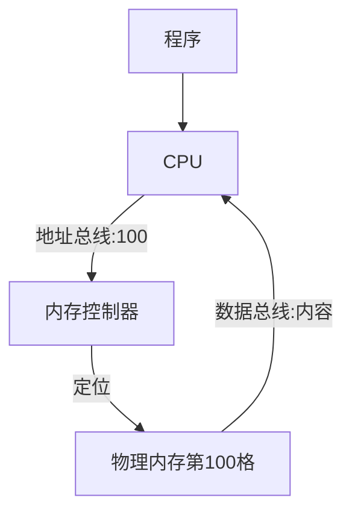

# 机器内存寻址原理：一份简单易懂的分享

---

## 一、什么是内存？

内存就像一排排储物柜，每个柜子都有编号（地址），用来临时存放数据。

```
+-----+-----+-----+-----+-----+
|  0  |  1  |  2  |  3  | ... |
+-----+-----+-----+-----+-----+
```

- 每个格子就是一个“内存单元”，编号就是“内存地址”。

---

## 补充：单块大内存 vs 多块小内存

有些电脑的内存像一整排超长储物柜（单块大内存），有些则像几排短柜子拼在一起（多块小内存）。

### 单块大内存

- 所有内容都连续存放，编号顺序排列。
- 取用数据时，编号和实际物理位置一一对应。

```
+-----+-----+-----+-----+-----+-----+-----+
|  0  |  1  |  2  |  3  |  4  |  5  | ... |
+-----+-----+-----+-----+-----+-----+-----+
（单块大内存，像一条长长的储物柜）
```

### 多块小内存

- 内存被分成几块，每块有自己的编号区间。
- 编号可能在不同物理位置，但对程序来说像一整块。

```
+-----+-----+-----+   +-----+-----+-----+
|  0  |  1  |  2  |...|1000 |1001 |1002 |
+-----+-----+-----+   +-----+-----+-----+
（多块小内存，像几组储物柜拼起来）
```

### 类比

- 单块大内存：像一条超长快递柜，所有格子连在一起。
- 多块小内存：像几个快递柜分布在不同楼层，但每个格子都有唯一编号。

---

## 二、内存地址怎么来的？

- 计算机给每个内存单元分配一个唯一编号（地址）。
- 程序需要数据时，只要告诉 CPU 地址，CPU 就能找到对应的格子。

### 生活类比

- 就像快递员送快递，只要有储物柜的编号，就能准确找到包裹。

---

## 三、CPU 如何通过地址找到数据？

1. 程序告诉 CPU：“我要 100 号格子的内容！”
2. CPU 通过“内存控制器”找到第 100 个格子。
3. 取出数据，交给程序。

```
[CPU] --(地址100)--> [内存控制器] --(定位)--> [内存第100格]
```

### 补充：CPU 快速寻址的详细链路

当程序需要某个内存地址的数据时，CPU 是这样一步步找到的：

1. **程序发出请求**：比如“我要 100 号格子的内容！”
2. **CPU 生成地址信号**：CPU 把 100 这个数字，通过“地址总线”发给内存控制器。
3. **内存控制器解析地址**：内存控制器收到地址信号，定位到物理内存的具体位置。
4. **数据总线传输数据**：内存控制器把对应格子的内容，通过“数据总线”送回 CPU。
5. **CPU 获得数据**：CPU 拿到数据，继续后续操作。

#### 流程图示意（Mermaid）



- **地址总线**：像一条专门传递“编号”的高速公路。
- **数据总线**：像一条专门传递“内容”的高速公路。
- **内存控制器**：像快递柜管理员，负责根据编号找到正确的格子。

---

## 四、内存地址的本质

- 地址其实就是一个数字。
- 计算机内部用二进制表示，比如 100 号格子就是 01100100。

---

## 五、常见问题解答

### Q1：内存地址会乱吗？

A：不会，每个格子编号唯一，互不干扰。

### Q2：内存不够怎么办？

A：新数据会覆盖旧数据，或者用硬盘等其他存储。

---

## 六、总结

- 内存寻址就像找储物柜，地址就是编号。
- 程序通过地址，CPU 能快速找到并操作数据。

---
